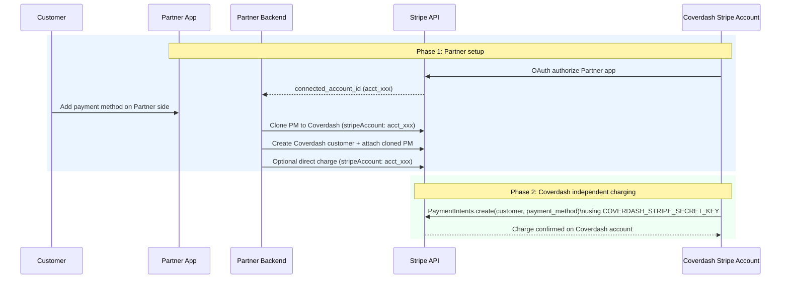

# Stripe Connect OAuth Integration Example

This Next.js + TypeScript demo shows a Stripe Connect OAuth flow between:

- **Partner** (platform account, owns OAuth app)
- **Coverdash** (connected account, receives funds)

It demonstrates two phases:

1. **Partner setup flow** (OAuth + payment method cloning + connected-account charge)
2. **Coverdash independent charging** using Coverdash's own Stripe API key

[](https://vercel.com/new/clone?repository-url=https%3A%2F%2Fgithub.com%2Fcoverdash%2Fstripe-connect-nextjs-example&env=NEXT_PUBLIC_PARTNER_STRIPE_CLIENT_ID,PARTNER_STRIPE_SECRET_KEY,COVERDASH_STRIPE_SECRET_KEY,NEXT_PUBLIC_VERCEL_PROJECT_PRODUCTION_URL)

## Two-Phase Flow Diagram



## Environment Variables

Copy `.env.example` to `.env`:

```bash
cp .env.example .env
```

Required variables:

```env
# Client Environment Variables (Partner app)
NEXT_PUBLIC_STRIPE_ENVIRONMENT=test
NEXT_PUBLIC_PARTNER_STRIPE_CLIENT_ID=ca_xxxxxxxxxxxxxxxxxxxxx
NEXT_PUBLIC_REDIRECT_URI=/oauth-callback

# Server Environment Variables
PARTNER_STRIPE_SECRET_KEY=sk_test_partner_xxxxxxxxxxxxxxxxxxxxx
COVERDASH_STRIPE_SECRET_KEY=sk_test_coverdash_xxxxxxxxxxxxxxxxxxxxx

# Local development
NEXT_PUBLIC_VERCEL_ENV=development
NEXT_PUBLIC_VERCEL_PROJECT_PRODUCTION_URL=localhost:3000
```

## Pages

- `/` - Main Partner setup flow (OAuth + clone + direct connected-account charge)
- `/coverdash-charge` - **Coverdash Independent Charge** page
  - Uses `COVERDASH_STRIPE_SECRET_KEY`
  - Creates PaymentIntents without `stripeAccount` header
  - Inputs: Customer ID, Payment Method ID, Amount, Currency, Description

## API Endpoints

- `POST /api/oauth/token` - Exchange OAuth code for connected account
- `POST /api/clone/payment-method` - Clone PM to connected account and attach
- `POST /api/customers` - Create connected-account customer
- `POST /api/transactions` - Partner-driven connected-account charge
- `POST /api/coverdash/charge` - Coverdash independent charge (own key)

## Run

```bash
yarn install
yarn dev
```

Build:

```bash
yarn build
yarn start
```

## Notes

- Partner key is used for OAuth and Stripe Connect (`stripeAccount`) operations.
- Coverdash key is used for independent charging after setup is complete.
- This is a demo; add proper auth, persistence, and production hardening before real use.
