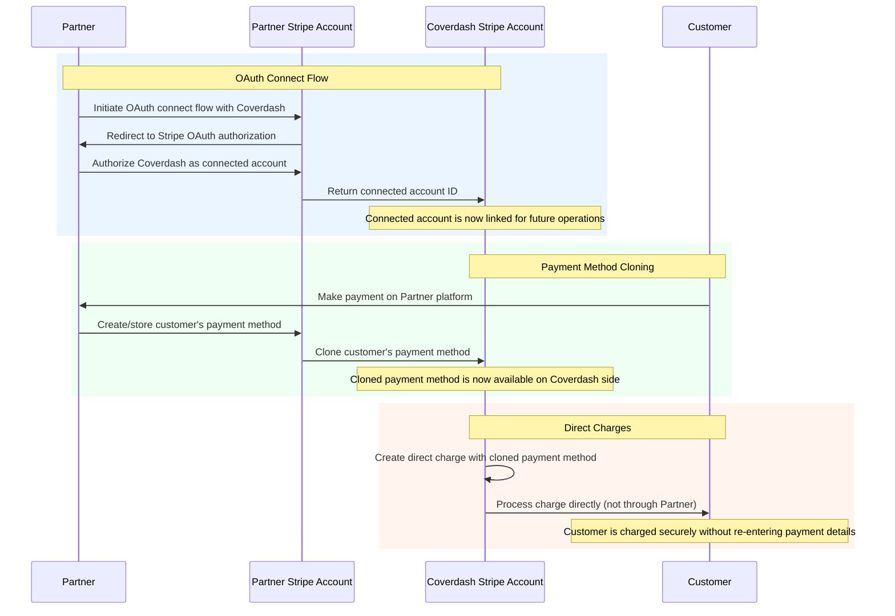

# Stripe Connect OAuth Integration Example

This Next.js TypeScript project demonstrates a Stripe Connect OAuth integration flow between two merchants. It showcases how Platform A can obtain authorization from Merchant B to perform direct charges using cloned payment methods.

[](https://vercel.com/new/clone?repository-url=https%3A%2F%2Fgithub.com%2Fcoverdash%2Fstripe-connect-nextjs-example&env=NEXT_PUBLIC_STRIPE_CLIENT_ID,STRIPE_SECRET_KEY,NEXT_PUBLIC_VERCEL_PROJECT_PRODUCTION_URL)

## Stripe Connect End-to-End Flow Diagram



## Overview

In this example, Platform A provides this application to Merchant B, allowing them to:

- Grant OAuth permissions to Platform A
- Allow access to customer payment methods via cloning
- Enable direct charges on the connected account

The integration uses the following Stripe APIs:

- [Connect OAuth](https://docs.stripe.com/connect/oauth-standard-accounts) - For partner authorization
- [Payment Methods API](https://docs.stripe.com/api/payment_methods) - For cloning payment methods
- [Payment Intents API](https://docs.stripe.com/api/payment_intents) - For creating direct charges
- [Customers API](https://docs.stripe.com/api/customers) - For managing customers

## Features

- OAuth connection flow with Stripe Connect
- Payment method cloning across accounts
- Direct charge processing on connected accounts
- Real-time transaction status updates
- Error handling and user feedback
- TypeScript type safety

## Prerequisites

Before running this application, you'll need:

- Node.js (v18 or higher)
- npm or yarn package manager
- Stripe account (for testing, use test mode)
- Environment variables (see `.env.example`)

## Installation

1. Clone the repository:
```bash
git clone https://github.com/coverdash/stripe-connect-nextjs-example.git
cd stripe-connect-nextjs-example
```

2. Install dependencies:
```bash
npm install
# or
yarn install
```

3. Set up environment variables:
```bash
cp .env.example .env
```

Edit `.env` and add your Stripe credentials.

## Configuration

Create a `.env` file in the root directory with the following variables:

```env
# Client Environment Variables (Platform/Merchant A)
NEXT_PUBLIC_STRIPE_ENVIRONMENT=test
NEXT_PUBLIC_STRIPE_CLIENT_ID=ca_xxxxxxxxxxxxxxxxxxxxx
NEXT_PUBLIC_REDIRECT_URI=/oauth-callback

# Server Environment Variables (Platform/Merchant A)
STRIPE_SECRET_KEY=sk_test_xxxxxxxxxxxxxxxxxxxxx

# For development only
NEXT_PUBLIC_VERCEL_ENV=development
NEXT_PUBLIC_VERCEL_PROJECT_PRODUCTION_URL=localhost:3000
```

### Getting Your Credentials

1. **Client ID**: 
   - Go to https://dashboard.stripe.com/settings/connect
   - Enable Standard accounts
   - Copy your client ID

2. **Secret Key**:
   - Go to https://dashboard.stripe.com/test/apikeys
   - Copy your test secret key

3. **Redirect URI**:
   - Add `http://localhost:3000/oauth-callback` to your OAuth redirect URIs in the Stripe Dashboard
   - For production, add your production domain's callback URL

## Running the Application

### Development Mode

```bash
npm run dev
# or
yarn dev
```

The application will be available at http://localhost:3000

### Production Build

```bash
npm run build
npm start
# or
yarn build
yarn start
```

## How It Works

### OAuth Flow

1. Merchant B clicks "Connect with Stripe" button
2. They are redirected to Stripe's OAuth consent page
3. Upon authorization, Stripe redirects back with an authorization code
4. The application exchanges this code for a connected account ID
5. Platform A can now clone payment methods and create charges on Merchant B's behalf

### Payment Method Cloning

1. Platform A has a payment method stored on their account
2. Using the Payment Methods API, they clone it to the connected account
3. The cloned payment method is an independent object with a unique ID
4. Platform A can now use this cloned payment method to charge the customer

### Direct Charges

1. Platform A creates a PaymentIntent on the connected account
2. The charge appears on the connected account's dashboard
3. The cloned payment method is consumed (one-time use)
4. For additional charges, clone the payment method again

## API Endpoints

- `POST /api/oauth/token` - Exchange authorization code for connected account ID
- `POST /api/clone/payment-method` - Clone a payment method to connected account
- `POST /api/transactions` - Create a direct charge on connected account
- `POST /api/customers` - Create a customer on connected account

## Important Limitations

⚠️ **Payment Method Support**: Can only clone `card` and `us_bank_account` payment method types

⚠️ **One-Time Use**: Each cloned payment method is consumed after one charge (must clone again for additional charges)

⚠️ **No Sync**: Cloned payment methods don't sync with the original if updated

⚠️ **Demo Storage**: This demo uses in-memory and localStorage for simplicity. Use a secure database in production.

## Security Considerations

- All sensitive credentials are stored in environment variables
- OAuth state parameter is used for CSRF protection
- Tokens are managed securely server-side (in production, use encrypted database)
- Never expose secret keys to the client

> **Warning**: This project is a demonstration and should not be used in production as-is. Implement proper authentication, secure token storage (database or secure session management), and follow all Stripe security best practices.

## Comparison with Braintree

| Feature | Braintree | Stripe |
|---------|-----------|--------|
| **Mechanism** | Grant nonce (temporary token) | Clone PaymentMethod |
| **Reusability** | One-time use, call grant() again | One-time use, clone again |
| **Supported Methods** | Cards, PayPal, Venmo, etc. | Cards and US bank accounts only |
| **OAuth** | Standard OAuth | Stripe Connect OAuth |
| **API Complexity** | Moderate | Moderate |

## Development

### Project Structure

```
├── components/          # React components
│   ├── ConnectButton.tsx
│   ├── OAuthCallback.tsx
│   ├── CloneTrigger.tsx
│   └── PaymentForm.tsx
├── lib/                # Utility functions
│   ├── stripe.ts       # Stripe client functions
│   ├── oauth.ts        # OAuth flow helpers
│   ├── config.ts       # Configuration management
│   ├── storage.ts      # Token storage (demo only)
│   └── types.ts        # TypeScript types
├── pages/              # Next.js pages
│   ├── api/            # API routes
│   ├── index.tsx       # Main page
│   └── oauth-callback.tsx
└── styles/             # Global styles
```

## Resources

- [Stripe Connect Documentation](https://docs.stripe.com/connect)
- [OAuth Standard Accounts](https://docs.stripe.com/connect/oauth-standard-accounts)
- [Payment Method Cloning](https://docs.stripe.com/connect/direct-charges-multiple-accounts)
- [Stripe API Reference](https://docs.stripe.com/api)

## License

MIT

## Contributing

Pull requests are welcome! For major changes, please open an issue first to discuss what you would like to change.
