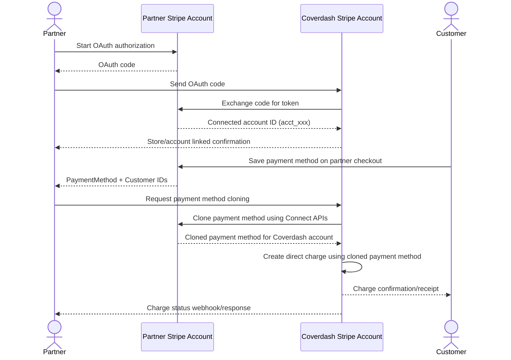

# Stripe Connect + Direct Charges Flow

```mermaid
sequenceDiagram
    actor Partner
    participant PStripe as Partner Stripe Account
    participant CStripe as Coverdash Stripe Account
    actor Customer

    Partner->>PStripe: Start OAuth authorization
    PStripe-->>Partner: OAuth code
    Partner->>CStripe: Send OAuth code
    CStripe->>PStripe: Exchange code for token
    PStripe-->>CStripe: Connected account ID (acct_xxx)
    CStripe-->>Partner: Store/account linked confirmation

    Customer->>PStripe: Save payment method on partner checkout
    PStripe-->>Partner: PaymentMethod + Customer IDs
    Partner->>CStripe: Request payment method cloning
    CStripe->>PStripe: Clone payment method using Connect APIs
    PStripe-->>CStripe: Cloned payment method for Coverdash account

    CStripe->>CStripe: Create direct charge using cloned payment method
    CStripe-->>Customer: Charge confirmation/receipt
    CStripe-->>Partner: Charge status webhook/response
```
